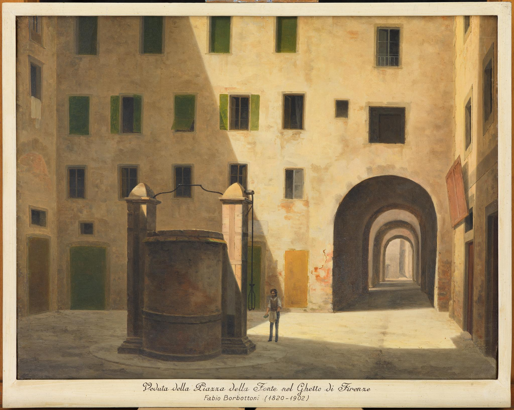
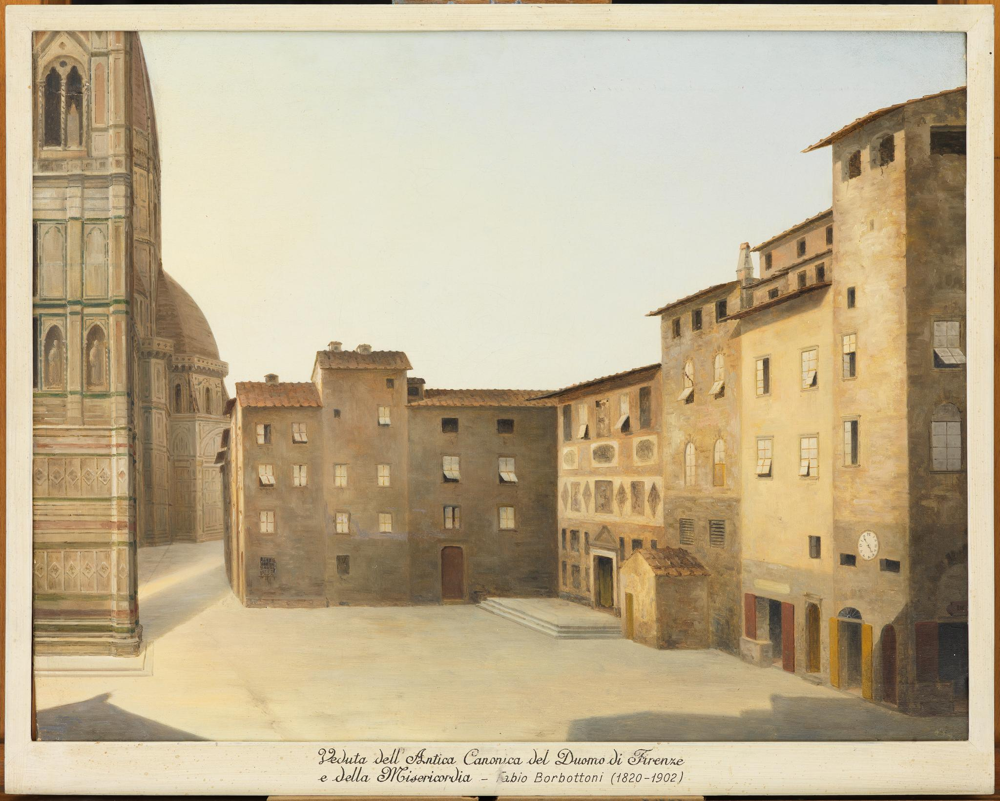

## Paintings by Fabio Borbottoni (1820-1902) 

 Fabio Borbottoni (1823-1901), a minor official in the Italian Railroad system, practiced painting as a hobby. The Florentine native produced over 120 small, square pictures of the city’s medieval structures as they appeared to him during the years of the Risorgimento – the period of Italian unification and statehood that arose during the decade of the 1860s and the latter decades of the nineteenth century when a national identity began to formulate... 

<a href="{{ '/people/borbottoni.html' | absolute_url }}">Continue Reading</a>

***

### [Mercato Vecchio:](#mercatovecchio)
- [Piazza S. Andrea](#sandrea)
- [Arte dei Linaioli e Rigattieri](#linaioli)
- [S. Maria degli Ughi](#smariaughi)
- [Palazzo Strozzi](#palazzostrozzi)
- [S. Maria in Campidoglio](#smariacampidoglio)
- [S. Pier Buonconsiglio](#spierbuonconsiglio)
- [S. Tommaso](#stommaso)
- [Via Strozzi](#viastrozzi)
- [S. Maria Tromba](#smariatromba)
- [Loggia del Pesce](#loggiadelpesce)
- [Palazzo Amieri](#palazzoamieri)
- [Piazza Fonte](#piazzafonte)

### [Piazza del Duomo:](#piazzadelduomo)
- [Bishop's Palace](#bishopspalace)
- [Bigallo](#bigallo)
- [Misericordia](#misericordia)

### [Government Buildings:](#government)
- [Loggia dei Lanzi](#loggiadeilanzi)
- [Palazzo della Signoria](#palazzosignoria)
- [Orsanmichele](#orsanmichele)
- [Bargello](#bargello)
- [Stinche](#stinche)

### [Bridges:](#bridges)
- [Ponte alle Grazie](#pontegrazie)
- [Ponte Vecchio](#pontevecchio)
- [Porta S. Niccolo](#portasniccolo)

***

# Mercato Vecchio 

## Piazza S. Andrea 
<figure>

 <figcaption markdown="1">
*Veduta della Piazza della Chiesa di S. Andrea nel Vecchio Mercato di Firenze*

"View of the Piazza della Chiesa di S. Andrea in the Old Market of Florence"

</figcaption>
</figure>

<figure id="sandrea2">

 <figcaption markdown="1">
*Via dei Cavalieri presa dalla Piazza di S. Andrea*

"View of the Via dei Cavalieri from the Piazza di S. Andrea"

</figcaption>
</figure>

## Arte dei Linaioli e Rigattieri 
<figure>

 <figcaption markdown="1">
*Antica residenza dell'Università dei Rigattieri, riunita dal Duca Alessandro all'Arte dei Linaioli*

"Ancient residence of the Guild of the Second-hand Dealers, which was united with the Linen Guild by the Duke Alessandro dei Medici"

</figcaption>
</figure>

## S. Maria degli Ughi 
<figure>

<figcaption markdown="1">
*Piazza degli Strozzi o della Cipolle con il Chiesino degli Strozzi e S. Maria degli Ughi, accanto al Palazzo dello Strozzino*

"Piazza degli Strozzi, also known as the Piazza della Cipolle, with the Chiesino degli Strozzi and S. Maria degli Ughi, next to the Palazzo dello Strozzino"

</figcaption>
</figure>

## Palazzo Strozzi 
<figure>

<figcaption markdown="1">
*Veduta del Palazzo e della Piazza degli Strozzi detta d. Cipolle, dell'Arco dei Pescioni e di S. Maria degli Ughi o Gran Madre del Buonconsiglio, accanto al Palazzo dello Strozzino*

"View of the Palace and the Piazza degli Strozzi, also known as the Piazza delle Cipolle, the Arco dei Pescioni and S. Maria degli Ughi or Gran Madre del Buonconsiglio, next to the Palazzo dello Strozzino"

</figcaption>
</figure>

## S. Maria in Campidoglio 
<figure>

<figcaption markdown="1">
*Vicolo e abituri con una colonna dorica, nel sito ove esisteva l'antico Campidoglio nel vecchio mercato di Firenze*

"Alley and dwellings with a Doric column, in the site where the ancient Campidoglio existed in the old market of Florence"

</figcaption>
</figure>

<figure id="smariacampidoglio2">

<figcaption markdown="1">
*Veduta in prospetto dell'Albergo della Palla, gia` S. Maria in Campidoglio, nel vecchio mercato di Firenze*

"Elevated view of the Albergo della Palla, formerly known as S. Maria in Campidoglio, in the old market of Florence"

</figcaption>
</figure>

## S. Pier Buonconsiglio 
<figure>

<figcaption markdown="1">
*Esterno della Chiesa di S. Pier Buonconsiglio, con le Scalere, della S. Pierino, sulla Via degli Strozzi del vecchio mercato di Firenze*

"Exterior of the Church of St. Pier Buonconsiglio, with the Staircase of S. Pierino on the Via degli Strozzi of the old market of Florence"

</figcaption>
</figure>

## S. Tommaso 
<figure>

 <figcaption markdown="1">
*Veduta della Chiesa di S. Tommaso dalla Piazza Grande del Vecchio Mercato fiorentino*

"View of the Church of St. Thomas from the Piazza Grande of the Old Florentine Market"

</figcaption>
</figure>

## Via Strozzi 
<figure>

 <figcaption markdown="1">
*Veduta della Via degli Strozzi allo sbocco della Piazza grande del Vecchio Mercato di Firenze*

"View of the Via degli Strozzi at the mouth of the Piazza Grande of the Old Market in Florence"

</figcaption>
</figure>

## S. Maria Tromba 
<figure>

 <figcaption markdown="1">
*Piazza Grande del Vecchio Mercato di Firenze, con il Tabernacolo, gia` Oratorio di S. Maria della Tromba e la Via Calimara*

"Piazza Grande of the Old Market in Florence, with the Tabernacle, formerly known as the Oratory of S. Maria della Tromba, and Via Calimara"

</figcaption>
</figure>

<figure id="smariatromba2">

</figure>

<figure id="smariatromba3">

 <figcaption markdown="1">
*Veduta della Piazza Grande del Vecchio Mercato di Firenze, presa dal Tabernacolo di S. Maria della Tromba*

"View of the Piazza Grande of the Old Market of Florence from the Tabernacle of S. Maria della Tromba"

</figcaption>
</figure>

## Loggia del Pesce 
<figure>

<figcaption markdown="1">
*Veduta della Loggia del Pesce sulla Piazza grande del Vecchio Mercato de Firenze*

"View of the Fish Loggia on the Piazza Grande of the Old Market of Florence"

</figcaption>
</figure>

## Palazzo Amieri 
<figure>

<figcaption markdown="1">
*Piazza grande del Mercato Vecchio di Firenze con in prospetto la Torre e Casa degli Amieri, presa dalla cantonata della Palla*

"Piazza Grande of the Old Market of Florence with the Torre and Casa degli Amieri on the front, taken from the corner of the square"

</figcaption>
</figure>

## Piazza Fonte 
<figure>

<figcaption markdown="1">
*Veduta della Piazza della Fonte nel Ghetto di Firenze*

"View of the Piazza della Fonte in the Ghetto of Florence"

</figcaption>
</figure>

# Piazza del Duomo 

## Bishop's Palace 
<figure>

<figcaption markdown="1">
*Veduta dell'ingresso al vecchio Arcivescovado*

"View of the entrance to the old Archbishopric"

</figcaption>
</figure>

<figure id="bishopspalace2">

<figcaption markdown="1">
*Piazza del Duomo e S. Giovanni con veduta dell'Arco dei Pecori e di parte del Palazzo Arcivescovile, preso dalla porta del Bigallo*

"Piazza del Duomo and S. Giovanni with a view of the Arco dei Pecori and part of the Archbishop's Palace, taken from the door of the Bigallo"

</figcaption>
</figure>

## Bigallo 
<figure>

<figcaption markdown="1">
*Veduta dell antico Corso degli Adimari ora Via dei Calzaioli, presa dalla parte della Loggia del Bigallo*

"View of the ancient Corso degli Adimari, now the Via dei Calzaioli, taken from the side of the Loggia of the Bigallo"

</figcaption>
</figure>

## Misericordia 
<figure>

<figcaption markdown="1">
*Veduta dell'Antica Canonica del Duomo di Firenze e della Misericordia*

"View of the Ancient Rectory of the Cathedral of Florence and of the Misericordia"

</figcaption>
</figure>

# Government Buildings 

## Loggia dei Lanzi 
<figure>

<figcaption markdown="1">
*Esterno dell'antica Chiesa di S. Pietro Scheraggio sul Canto di Via d. Minna, ove fu contruita la Loggia d. Uffizi, con veduta della Loggia dell'Orcagna e di Palazzo Vecchio con le Torri*

"Exterior of the ancient Church of S. Pietro Scheraggio at the beginning of the Via d. Minna, where the Loggia of the Uffizi was built, with a view of the Loggia dei Lanzi and the Palazzo Vecchio with the Towers"

</figcaption>
</figure>

## Piazza della Signoria 
<figure>

<figcaption markdown="1">
*Antico Tetto dei Pisani in Piazza della Signoria*

"Ancient Roof of the Pisans in the Piazza della Signoria"

</figcaption>
</figure>

<figure id="palazzosignoria2">

<figcaption markdown="1">
*Antico tetto dei Pisani in Piazza della Signoria a Firenze e Campanile di S. Cecilia*

"Ancient roof of the Pisans in the Piazza della Signoria of Florence and the bell tower of S. Cecilia"

</figcaption>
</figure>

## Orsanmichele 
<figure>

<figcaption markdown="1">
*Veduta della via dei Calzaioli avanti il 1844*

"View of the Via dei Calzaioli before 1844"

</figcaption>
</figure>

<figure id="orsanmichele2">

<figcaption markdown="1">
*Residenza dell'Arte della Lana e Scala dell'Archivio sulla Via d'Orsanmichele*

"Headquarters of the Wool Guild and the stairs of the Archive on the Via d'Orsanmichele"

</figcaption>
</figure>

## Bargello 
<figure>

<figcaption markdown="1">
*Piazza di S. Firenze, lato accanto a Badia, Palazzo del Podesta` e Chiesa di S. Apollinare*

"Side view of the Piazza di S. Firenze and the Badia, with the Palazzo del Podestà and Church of S. Apollinare to the right

</figcaption>
</figure>

## Stinche 
<figure>

<figcaption markdown="1">
*Veduta esterna dell'antica Isola delle Stinche presso S. Croce, lato sulla via del Fosso e lato dei Lavatoi dell'Arte della Lana*

"External view of the ancient Isola delle Stinche near S. Croce from the via del Fosso and the side of the wash-houses of the Wool Guild"

</figcaption>
</figure>

<figure id="stinche2">

<figcaption markdown="1">
*Veduta esterna dell'antica Isola delle Stinche presso S. Croce, lato sulla Via Ghibellina*

"External view of the ancient Isola delle Stinche near S. Croce from the Via Ghibellina"

</figcaption>
</figure>

<figure id="stinche3">

</figure>

# Bridges 

## Ponte alle Grazie 
<figure>

<figcaption markdown="1">
*Veduta del Ponte alle Grazie con le Casine*

"View of the Ponte alle Grazie with the nuns' cells"

</figcaption>
</figure>

<figure id="pontegrazie2">

<figcaption markdown="1">
*Veduta del Ponte alle Grazie con le Casine, del Tiratojo, della Porticciola e Scalo e del principio degli Sportici di via degli Archibusieri, prima della costruzione del Viale dei Colli e del Lungarno Corrigiani*

View of the Ponte alle Grazia with the nuns' cells, the wool loom, the gate and the stairs of the principal entrance to the Via degli Archibusieri, before the construction of the Via delle Colle and the Lungarno Corrigiani

</figcaption>
</figure>

<figure id="pontegrazie3">

<figcaption markdown="1">
*Veduta del Monte alle Croci, delle Molina sui Renai e del Ponte alle Grazie, presa nel momento della costruzione del Lungarno Corrigiani*

"View of Monte alle Croci, Molina sui Renai and Ponte alle Grazie, taken at the time of construction of the Lungarno Corrigiani"

</figcaption>
</figure>

## Ponte Vecchio 
<figure>

<figcaption markdown="1">
*Ponte Vecchio e Lungarno degli Uffizi fino alla Porticciola, presi dal Ponte alle Grazie, prima delle nuove costruzione*

"Ponte Vecchio and Lungarno of the Uffizi to the Porticciola, taken from the Ponte alle Grazie, before the new construction"

</figcaption>
</figure>

<figure id="pontevecchio2">

<figcaption markdown="1">
*Veduta del Ponte Vecchio fortificato come era anticamente*

"View of the Ponte Vecchio fortified as it was in ancient times"

</figcaption>
</figure>

## Porta S. Niccolo 
<figure>

<figcaption markdown="1">
*Veduta delle antiche Mura di Firenze: Porta di S. Niccolò in Oltrarno*

"View of the ancient walls of Florence: Porta di S. Niccolò in Oltrarno"

</figcaption>
</figure>

<a id="returnbutton" href="#paintings" class="button">Back to Top</a>
