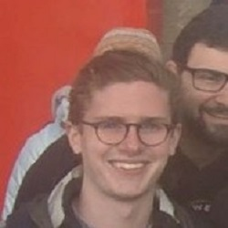

  <article>
    
    

      <h3>Professor George Bent</h3>
      
George R. Bent received his Bachelor of Arts Degree from Oberlin College in 1985 and his Ph.D in Art History from Stanford University in 1993. He came to Washington and Lee University in that year and has been a member of the faculty ever since. Bent teaches courses in Medieval and Renaissance art history, and specializes in fourteenth- and early fifteenth-century Italian art and culture. He co-founded Washington and Lee’s interdisciplinary program in Medieval and Renaissance Studies, chaired it from 2000 to 2003, served as Associate Dean of the College from 2003-2006, and chaired the Department of Art and Art History from 2001 to 2003 and 2008 to 2014. A two-time holder of Fulbright grants to Italy, he has written about artistic production, the function of liturgical images, and institutional patronage in early Renaissance Florence. He addressed these subjects in his book <i>Monastic Art in Lorenzo Monaco’s Florence</i> (published in 2006) and in his DVD lecture series, <i>Leonardo da Vinci and the Italian High Renaissance</i>, produced by the Great Courses Company in 2012. He then focused his scholarly attention on the subject of art for common viewers in late Medieval Florence between 1280 and 1430: his book on this material, <i>Public Pictures and Visual Culture in Early Republican Florence</i> (Cambridge University Press), was published in 2016.

    

  </article>
  <article>
    
    

      <h3>Miles Bent</h3>
      
Aenean ornare velit lacus, ac varius enim lorem ullamcorper dolore. Proin aliquam facilisis ante interdum. Sed nulla amet lorem feugiat tempus aliquam.

    

  </article>
  <article>
    
    

      <h3>Sonia Brozak</h3>
      
Sonia is a senior Art History and Medieval & Renaissance Studies double major with a minor in German from New York, New York. She is undertaking two thesis projects, one of which deals with appropriationist art of the 1980s and the other looks at conceptions of spatial mapping in Early Modern Florence. She has spent time abroad in Münster, Germany; Florence, Italy; and Paris, France improving her German, Italian, and French. Sonia serves as the Secretary of the Student Body at Washington and Lee and is a member of Pi Beta Phi sorority. In her spare time, she enjoys spending time with friends and reading The New Yorker.

    

  </article>
  <article>
    
    

      <h3>Sam Joseph</h3>
      
Sam Joseph is a sophomore at Washington and Lee University majoring in Art History and planning on attending graduate school for architecture. He hails from Dallas, Texas, and before attending W&L, he took a gap year and lived in Ho Chi Minh City, Vietnam.

    

  </article>
  <article>
    
    

      <h3>Aidan Valente</h3>
      
Aidan is a Medieval and Renaissance Studies and Art History double-major. He has experience with Italian and French, digital humanities languages such as HTML, CSS, and Command Line, and has worked in the University's Special Collections archives.

    

  </article>

