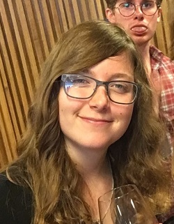
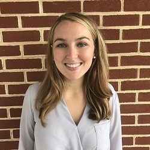
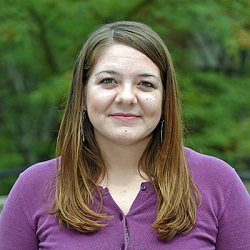

  <article>
    
    

      <h3>Sam Joseph</h3>
      
Sam Joseph is a junior at Washington and Lee University majoring in Art History and planning on attending graduate school for architecture. He hails from Dallas, Texas, and before attending W&L, he took a gap year and lived in Ho Chi Minh City, Vietnam.

    

  </article>
  <article>
    
    

      <h3>Aidan Valente</h3>
      
Aidan is a Medieval & Renaissance Studies and Art History double-major and a potential Classics minor. He has studied Italian and French, is starting Latin this year, and spent the summer working on Florence As It Was and practicing his Italian in Italy. He spends much of his time working on Digital Humanities projects involving the University's Special Collections archives, where he worked over the summer of 2016. Outside the classroom, he participates in Catholic Campus Ministry,   and the Shakespeare Society.

    

  </article>
  <article>
    
    

      <h3>MC Greenleaf</h3>
      
MC is an Art and Computer Science double-major. She has spent several summers in Florence and her family has contributed to preserving the city's historic cultural heritage.

    

  </article>
  <article>
    
    

    <h3>Katherine Dau</h3>
    
Bio entry goes here

    

  </article>
  <article>
    
    

    <h3>Colby Gilley</h3>
    
Bio entry goes here

    

  </article>

<h1>Past Contributors</h1>

  <article>
    
    

      <h3>Miles Bent</h3>
      
Miles graduated in 2017 a Global Politics and English double major. Born and raised in Lexington, VA, he has spent a year in Florence, Italy, and an additional semester abroad in Rome, Italy, where he took courses in Italian and Art History. Miles is a member of Beta Theta Pi fraternity, played soccer for Washington and Lee for three years, and served as a Peer Counselor on campus.

    

  </article>
  <article>
    
    

      <h3>Sonia Brozak</h3>
      
From New York, New York, Sonia graduated with a double major in Art History and Medieval & Renaissance Studies and a minor in German. She undertook two thesis projects, one of which deals with appropriationist art of the 1980s and the other looks at conceptions of spatial mapping in Early Modern Florence. She has spent time abroad in Münster, Germany; Florence, Italy; and Paris, France improving her German, Italian, and French. Sonia served as the Secretary of the Student Body at Washington and Lee and is a member of Pi Beta Phi sorority. In her spare time, she enjoys spending time with friends and reading The New Yorker.

    

  </article>

<h1>Collaborators</h1>

  <article>
    
    

      <h3>Professor George Bent</h3>
      
George R. Bent received his Bachelor of Arts Degree from Oberlin College in 1985 and his Ph.D in Art History from Stanford University in 1993. He came to Washington and Lee University in that year and has been a member of the faculty ever since. Bent teaches courses in Medieval and Renaissance art history, and specializes in fourteenth- and early fifteenth-century Italian art and culture. He co-founded Washington and Lee’s interdisciplinary program in Medieval and Renaissance Studies, chaired it from 2000 to 2003, served as Associate Dean of the College from 2003-2006, and chaired the Department of Art and Art History from 2001 to 2003 and 2008 to 2014. A two-time holder of Fulbright grants to Italy, he has written about artistic production, the function of liturgical images, and institutional patronage in early Renaissance Florence. He addressed these subjects in his book <i>Monastic Art in Lorenzo Monaco’s Florence</i> (published in 2006) and in his DVD lecture series, <i>Leonardo da Vinci and the Italian High Renaissance</i>, produced by the Great Courses Company in 2012. He then focused his scholarly attention on the subject of art for common viewers in late Medieval Florence between 1280 and 1430: his book on this material, <i>Public Painting and Visual Culture in Early Republican Florence</i> (Cambridge University Press), was published in 2016.

    

  </article>
  <article>
    
    

    <h3>Dave Pfaff</h3>
    
Dave Pfaff is the coordinator for Washington and Lee's IQ center. He works to foster cross-disciplinary and quantitative approaches to inspire creativity and problem solving in teaching and research.

    

  </article>
  <article>
    
    

    <h3>Mackenzie Brooks</h3>
    
Mackenzie Brooks is Assistant Professor and Digital Humanities Librarian at Washington and Lee University. Prior to her current position, she worked as Metadata Librarian at W&L and at the Loyola University Chicago Health Sciences Library. As a member of the Digital Humanities Action Team, she advises faculty and students on best practices for metadata standards in digital humanities projects. Additionally, she teaches undergraduate courses on scholarly text encoding and digital humanities.

    

  </article>
  <article>
    
    

    <h3>Erik Gustafson</h3>
    
Erik Gustafson received his Ph.D. from the Institute of Fine Arts, New York University in 2012. Currently a Visiting Assistant Professor of Art History at Washington and Lee University, he has taught at George Mason University, Fordham University, and the University of California, Berkeley, and held a Rome Prize fellowship at the American Academy in Rome from 2007-2009. An architectural historian of medieval and renaissance Europe and the Mediterranean, Erik is broadly interested in the engagement of historical viewers with architectural space. He is particularly interested in the phenomenology of historical religious experience, and in how the constant dialogue between traditions of the past and the needs of the present produced architectural culture. Erik has forthcoming articles on Franciscan architecture as charismatic space and on a Crusader portal reused on a Mamluk madrasa in Cairo, and is completing a monograph entitled Building Franciscanism: Space, Tradition, and Devotion in Medieval Tuscany.

    

  </article>

