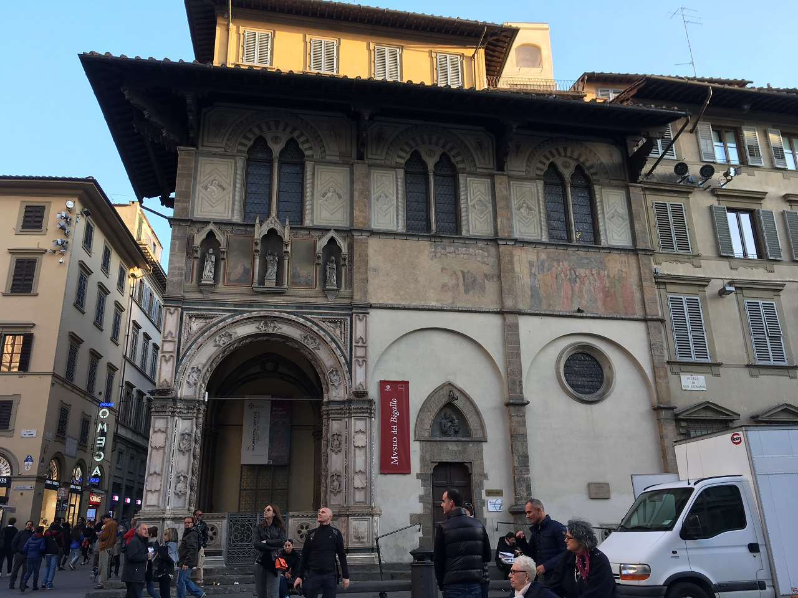

<!-- Section -->
<section>
	<header class="major">
		<h2>Buildings</h2>
	</header>
	

		<article>
			
			<h3>Bigallo</h3>
			
Built in c. 1360, the Oratory of the Misericordia, as it was then known, has endured expansions, fires, renovations, a merger, and more to become the elegant structure that stands on the Piazza del Duomo today. Read more about the structure's tumultous history here. Explore the headquarters of one of the city's most prominent charities, the Confraternity of the Misericordia, later merged with that of the Bigallo, and see the art that it commissioned to assert its place in Florentine society.

			<ul class="actions">
				<li><a href="{{ 'bigallo.html' | absolute_url }}" class="button">More</a></li>
			</ul>
		</article>
		<article>
			
			<h3>Orsanmichele</h3>
			
View the monumental statues produced by Florence's leading sculptors for the city's guilds, which were commissioned to decorate this grain market-turned-church. One of the city's grandest examples of the Medieval and Renaissance connection between religion, politics, and art, the granary and later church of Orsanmichele has an extremely complex history. To help make sense of it, we've collected some sources here for edification.

			<ul class="actions">
				<li><a href="{{ 'orsanmichele.html' | absolute_url }}" class="button">More</a></li>
			</ul>
		</article>
	

</section>

<section>
	<header class="major">
		<h2>Models</h2>
	</header>
	

		<article>
			

			  <iframe width="100%" height="480" src="https://sketchfab.com/models/8910d0c235674c409accecb093690d9c/embed" frameborder="0" allowvr allowfullscreen mozallowfullscreen="true" webkitallowfullscreen="true" onmousewheel=""></iframe>

			

			    <a href="https://sketchfab.com/models/8910d0c235674c409accecb093690d9c?utm_medium=embed&utm_source=website&utm_campain=share-popup" target="_blank" style="font-weight: bold; color: #1CAAD9;">Bigallo 8192</a>
			    by <a href="https://sketchfab.com/iqcenter?utm_medium=embed&utm_source=website&utm_campain=share-popup" target="_blank" style="font-weight: bold; color: #1CAAD9;">IQ Center</a>
			    on <a href="https://sketchfab.com?utm_medium=embed&utm_source=website&utm_campain=share-popup" target="_blank" style="font-weight: bold; color: #1CAAD9;">Sketchfab</a>
			

			

		</article>
		<article>
			<h3>The Loggia of the Bigallo</h3>
			
This model of the Loggia of the Bigallo was created using over 2000 images and a process called photogrammetry.

		</article>
	

</section>

<!-- Section -->
<section>
	<header class="major">
		<h2>Resources</h2>
	</header>
	

		<article>
			
			

				<h3>Del Migliore</h3>
				
Del Migliore - Italian, 1684

			

		</article>
		<article>
			
			

				<h3>Rika</h3>
				
Rika - Italian, 1752-1760

			

		</article>
		<article>
			
			

				<h3>Paatz</h3>
				
Paatz - German, 1952-1955

			

		</article>
		<article>
			
			

				<h3>Miscellaneous</h3>
				
Miscellaneous - Context-dependent

			

		</article>
	

</section>

<!-- Something here about Copyright and how we are not in violation of any copyright laws because the bulk of these materials have passed out of protection -->

<section>
	

	<h2>Affiliations</h2>
	
	

</section>
