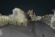

<h2 class="display-6 lh-lg" id="home-text">The Digital Reconstruction of a Medieval City</h2>
  

    

      
Welcome to Florence As It Was, a digital project that aims to reconstruct the city the way it appeared at the end of the fifteenth century. Here you can review, inspect, tour, and visit the streets, palaces, churches, shops, and offices that formed the fabric of one of Europe’s most vibrant cities. Here you will find images, people, payments, relationships, literary references, contemporary descriptions, and sometimes even music related to the individual structures that shaped a Florentine’s daily experience in 1500.

		
Here you can read, in English, the Italian and German interpretations of these people and places that were written by critics and scholars in the 17th, 18th, and 20th centuries. See the seat of government and power in the late Middle Ages. Walk through the streets and buildings where Cosimo de’ Medici spent much of his time. Examine the most important cult painting in the city and the tabernacle that framed it. Zoom in close, fly high above, or approach these places from below. Search for names, places, dates, and events, and see how links and connections can be made in unexpected ways. Above all, imagine.

		
There’s a lot of information and a lot of data in these sites, so have patience while they load. It’s worth the wait. 

		<a href="about.html"><button type="button" class="btn btn-success">Learn More</button></a>
	

    

      <a href="">
      <h3 class="lh-lg">Maps & Data</h3>
  </a>
        <a href="3d_models.md">
      <h3>3D Models</h3>
  </a>
    

  

<h2>Buildings</h2>
<table style="width:100%">
	 	 
	   	  
<tbody><tr>
					<td><b><h3><a href="architecture/bargello">The Bargello</a></h3></b></td>
					<td></td>
					<td>Palace of the Podestà, jail, and chapel for the condemned</td>
				</tr>
	   
<tr>
					<td><b><h3><a href="architecture/bigallo">The Bigallo</a></h3></b></td>
					<td></td>
					<td>Fourteenth-century charitable institution</td>
				</tr>
	   
<tr>
					<td><b><h3><a href="architecture/innocenti">The Innocenti</a></h3></b></td>
					<td></td>
					<td>15th century children's hospital</td>
				</tr>
	   
<tr>
					<td><b><h3><a href="architecture/orsanmichele">Orsanmichele</a></h3></b></td>
					<td></td>
					<td>Fourteenth-century granary and church of the guilds</td>
				</tr>
	   
<tr>
					<td><b><h3><a href="architecture/palazzo-davanzati">Palazzo Davanzati</a></h3></b></td>
					<td></td>
					<td>14th century merchant's residence</td>
				</tr>
	   
<tr>
					<td><b><h3><a href="architecture/san-lorenzo">San Lorenzo</a></h3></b></td>
					<td></td>
					<td>Fifteenth-century parish church, brainchild of Brunelleschi and burial ground of the early Medici</td>
				</tr>
	   
<tr>
					<td><b><h3><a href="architecture/san-miniato">San Miniato</a></h3></b></td>
					<td></td>
					<td>Eleventh-century Olivetan church and monastery</td>
				</tr>
	   
<tr>
					<td><b><h3><a href="architecture/santa-croce">Santa Croce</a></h3></b></td>
					<td></td>
					<td>Fourteenth- and fifteenth-century Franciscan church and friary</td>
				</tr>
	   
<tr>
					<td><b><h3><a href="architecture/santa-maria-del-fiore">Santa Maria del Fiore (The Duomo)</a></h3></b></td>
					<td></td>
					<td>Early Christian foundations; 14th century nave; 15th century cupola</td>
				</tr>
	   
<tr>
					<td><b><h3><a href="architecture/santa-maria-novella">Santa Maria Novella</a></h3></b></td>
					<td></td>
					<td>Dominican convent and cloisters of Santa Maria Novella (1275)</td>
				</tr>
	   
<tr>
					<td><b><h3><a href="architecture/santa-trinita">Santa Trinita</a></h3></b></td>
					<td></td>
					<td>Thirteenth-century church of Santa Trinita</td>
				</tr>
	   
</tbody>
</table>

