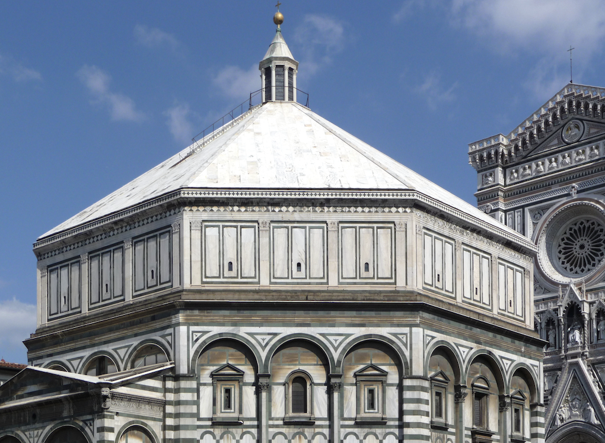

<h2 class="display-6 lh-lg" id="home-text">The Digital Reconstruction of a Medieval City</h2>
  

    

      
Welcome to Florence As It Was, a digital project that aims to reconstruct the city the way it appeared at the end of the fifteenth century. Here you can review, inspect, tour, and visit the streets, palaces, churches, shops, and offices that formed the fabric of one of Europe’s most vibrant cities. Here you will find images, people, payments, relationships, literary references, contemporary descriptions, and sometimes even music related to the individual structures that shaped a Florentine’s daily experience in 1500.

		
Here you can read, in English, the Italian and German interpretations of these people and places that were written by critics and scholars in the 17th, 18th, and 20th centuries. See the seat of government and power in the late Middle Ages. Walk through the streets and buildings where Cosimo de’ Medici spent much of his time. Examine the most important cult painting in the city and the tabernacle that framed it. Zoom in close, fly high above, or approach these places from below. Search for names, places, dates, and events, and see how links and connections can be made in unexpected ways. Above all, imagine.

		
There’s a lot of information and a lot of data in these sites, so have patience while they load. It’s worth the wait. 

	    
		<a href="about.html"><button type="button" class="btn btn-success">Learn More</button></a>
		
		  
		<a>Our Latest Contribution</a>
		  
		<iframe width="560" height="315" src="https://www.youtube.com/embed/XccGdP2FQuI" title="Orsanmichele 1300 vs 1500" frameborder="0" allow="accelerometer; autoplay; clipboard-write; encrypted-media; gyroscope; picture-in-picture; web-share" referrerpolicy="strict-origin-when-cross-origin" allowfullscreen></iframe>
    
	    <iframe width="560" height="315" src="https://www.youtube.com/embed/ET1Yaumugyc?si=ayd9mbgSF2FwBvxe" title="YouTube video player" frameborder="0" allow="accelerometer; autoplay; clipboard-write; encrypted-media; gyroscope; picture-in-picture; web-share" referrerpolicy="strict-origin-when-cross-origin" allowfullscreen></iframe>
	

    

      
      <a href="maps.html"><h3 class="lh-lg">Maps & Databases</h3> </a>
      
      <a href="pointcloud-models.html"><h3>Pointcloud Models</h3></a>
      
      <a href="photogrammetry-models.html"><h3>Photogrammetry Models</h3></a>

    

  

<h2>Buildings</h2>

  
  

    <h5 class="card-title">SS. Annunziata</h5>
    
Cult center and convent of Santissima Annunziata.

    <a href="{{ 'architecture/annunziata.html' | absolute_url }}" class="btn btn-primary">Learn more</a>
  

	

	  
		  

		    <h5 class="card-title">SS. Apostoli</h5>
		    
Ninth-century parish church.

<a href="{{ 'architecture/santi-apostoli.html' | absolute_url }}" class="btn btn-primary">Learn more</a>
		  

	

  
  

    <h5 class="card-title">Badia</h5>
    
The Benedictine Abbey of Florence.

    <a href="{{ 'architecture/badia.html' | absolute_url }}" class="btn btn-primary">Learn more</a>
  

  

  
  

    <h5 class="card-title">Bargello</h5>
    
Palace of the Podestà, jail, and chapel for the condemned.

    <a href="{{ 'architecture/bargello.html' | absolute_url }}" class="btn btn-primary">Learn more</a>
  

	

	  
		  

		    <h5 class="card-title">Bigallo</h5>
		    
14th-century charitable institution.

<a href="{{ 'architecture/bigallo.html' | absolute_url }}" class="btn btn-primary">Learn more</a>
		  

	

	

	  
		  

		    <h5 class="card-title">S. Croce</h5>
		    
Thirteenth- and fourteenth-century Franciscan church and friary.

<a href="{{ 'architecture/santa-croce.html' | absolute_url }}" class="btn btn-primary">Learn more</a>
		  

	

  
  

    <h5 class="card-title">S. Giovanni</h5>
    
Eleventh-century baptistery of S. Giovanni.

    <a href="{{ 'architecture/baptistery.html' | absolute_url }}" class="btn btn-primary">Learn more</a>
  

	

	  
		  

		    <h5 class="card-title">S. Lorenzo</h5>
		    
Fifteenth-century parish church, brainchild of Brunelleschi and burial ground of the early Medici.

<a href="{{ 'architecture/san-lorenzo.html' | absolute_url }}" class="btn btn-primary">Learn more</a>
		  

	

	

	  
		  

		    <h5 class="card-title">S. Maria del Fiore</h5>
		    
The Duomo of the fourteenth and fifteenth centuries; foundations of early church of S. Reparata.

<a href="{{ 'architecture/santa-maria-del-fiore.html' | absolute_url }}" class="btn btn-primary">Learn more</a>
		  

	

	

	

	  
		  

		    <h5 class="card-title">S. Maria Novella</h5>
		    
Thirteenth- and fourteenth-century Dominican convent, ca. 1275.

<a href="{{ 'architecture/santa-maria-novella.html' | absolute_url }}" class="btn btn-primary">Learn more</a>
		  

	

	

	  
		  

		    <h5 class="card-title">S. Miniato</h5>
		    
Eleventh-century church and monastery.

<a href="{{ 'architecture/san-miniato.html' | absolute_url }}" class="btn btn-primary">Learn more</a>
		  

	

	

	  
		  

		    <h5 class="card-title">Orsanmichele</h5>
		    
Fourteenth-century granary and church of the guilds.

<a href="{{ 'architecture/orsanmichele.html' | absolute_url }}" class="btn btn-primary">Learn more</a>
		  

	

	

	  
		  

		    <h5 class="card-title">Ospedale degli Innocenti</h5>
		    
15th century children's hospital.

<a href="{{ 'architecture/innocenti.html' | absolute_url }}" class="btn btn-primary">Learn more</a>
		  

	

	

	  
		  

		    <h5 class="card-title">Palazzo Davanzati</h5>
		    
14th century merchant's residence, Davizzi family.

<a href="{{ 'architecture/palazzo-davanzati.html' | absolute_url }}" class="btn btn-primary">Learn more</a>
		  

	

	

	  
		  

		    <h5 class="card-title">Palazzo Medici</h5>
		    
Residence built by Cosimo de' Medici.

<a href="{{ 'architecture/palazzo-medici.html' | absolute_url }}" class="btn btn-primary">Learn more</a>
		  

	

	

	  
		  

		    <h5 class="card-title">S. Remigio</h5>
		    
Thirteenth-century parish church.

<a href="{{ 'architecture/san-remigio.html' | absolute_url }}" class="btn btn-primary">Learn more</a>
		  

	

	

	  
		  

		    <h5 class="card-title">S. Spirito</h5>
		    
Fifteenth-century Servite convent designed by Brunelleschi.

<a href="{{ 'architecture/san-spirito.html' | absolute_url }}" class="btn btn-primary">Learn more</a>
		  

	

	

	  
		  

		    <h5 class="card-title">S. Trinita</h5>
		    
Fourteenth-century church built on top of twelfth-century structure.

<a href="{{ 'architecture/santa-trinita.html' | absolute_url }}" class="btn btn-primary">Learn more</a>
		  

	

