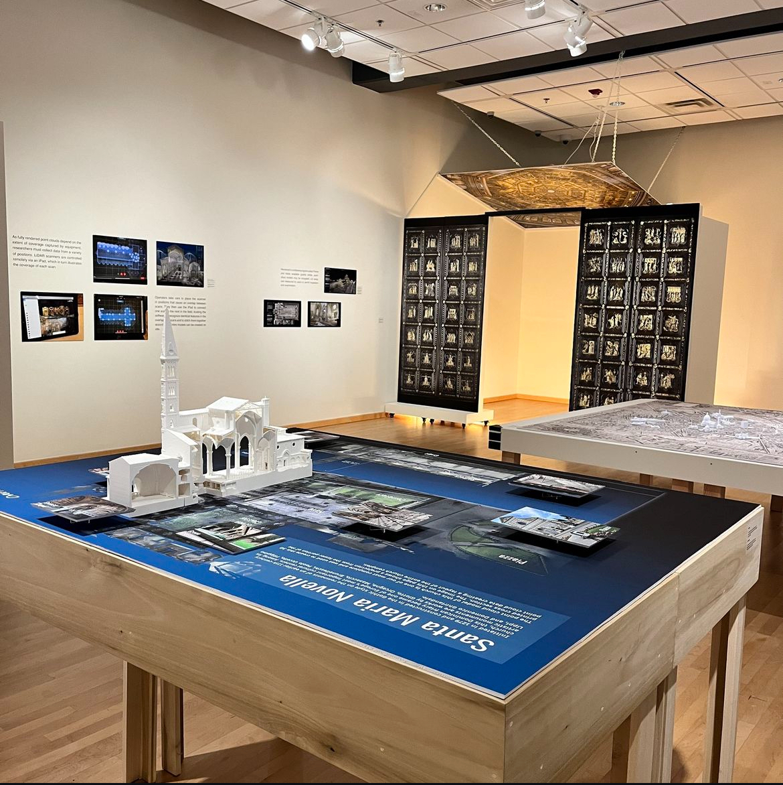
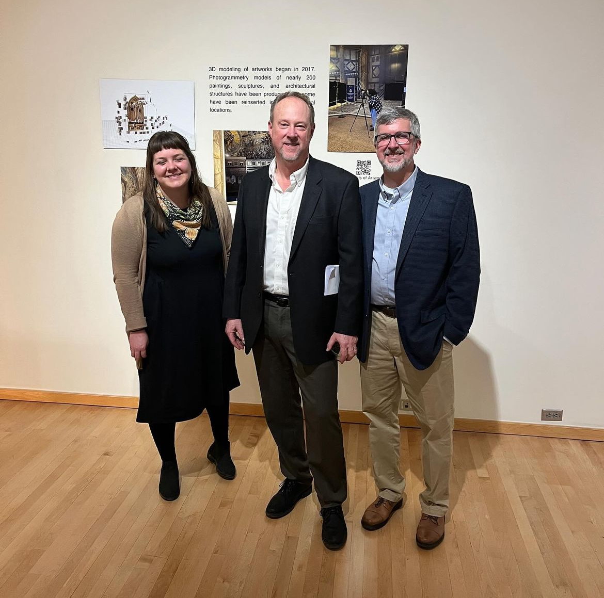
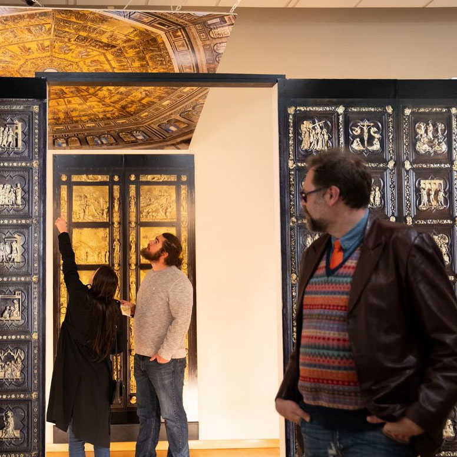

* ["Florence As It Was Chosen for National Competition," The Columns, December 9, 2024](https://columns.wlu.edu/florence-as-it-was-chosen-for-national-competition/)
* ["Video game inspires massive online re-creation of a cultural hot spot in 1500," RadioIQ, August 19, 2024](https://www.wvtf.org/news/2024-08-19/video-game-inspires-massive-online-re-creation-of-a-cultural-hot-spot-in-1500)
* ["Reconstructing the Past," The Columns, July 26, 2024](https://columns.wlu.edu/reconstructing-the-past/)
* ["Project Consortium Awarded a National Endowment for the Humanities Grant," The Columns, May 8, 2024](https://columns.wlu.edu/project-consortium-awarded-a-national-endowment-for-the-humanities-grant/)
* ["W&L's Staniar Gallery Presents _Florence As it Was_," The Columns, January 30, 2024](https://columns.wlu.edu/wls-staniar-gallery-presents-florence-as-it-was/)
* ["George Bent's _Florence As it Was_ Project Featured in Case Study and Documentary," The Columns, August 1, 2023](https://columns.wlu.edu/george-bents-florence-as-it-was-project-featured-in-case-study-and-documentary/)
* ["Unveiling the Past: Digitally Reconstructing Florence," Leica Geosystems](https://leica-geosystems.com/case-studies/reality-capture/florence-as-it-was)  [(Watch the full documentary here)](https://share.vidyard.com/watch/jdK9T3KQmcgaFsHEhLGJwQ?)
* ["Washington and Lee University Receives Grant from the Samuel H. Kress Foundation," The Columns, May 23, 2023"](https://columns.wlu.edu/washington-and-lee-university-receives-grant-from-the-samuel-h-kress-foundation/)
* ["W&L Trio Publiches Article in the Heritage Science Journal," The Columns, October 20, 2022](https://columns.wlu.edu/wl-trio-publishes-article-in-the-heritage-science-journal/)
* ["New Podcast Episode Explores _Florence As it Was_," The Columns, November 15, 2021](https://columns.wlu.edu/new-podcast-explores-florence-as-it-was/)

## Staniar Gallery Exhibit

  

    

    
  

  

    
  

  

    
  

In February 2024, _Florence As it Was: The Digital Reconstruction of a Medeival City_ opened in W&L's Staniar Gallery. The exhibition presented the ongoing art historical project _Florence As It Was_, which aims to digitally reconstruct the Italian city the way it appeared at the end of the fifteenth century. This exhibition featured some of the 27 point clouds and 181 photogrammetry models that have been produced by David Pfaff, George Bent, Mackenzie Brooks, and a host of W&L students since the project’s inception in 2016.

### Exhibit Talk 
<iframe src="https://wlu.app.box.com/s/tu477lqrvlpclbbvzuwsrn38u8bhekpk" width="600x" height="400px">
